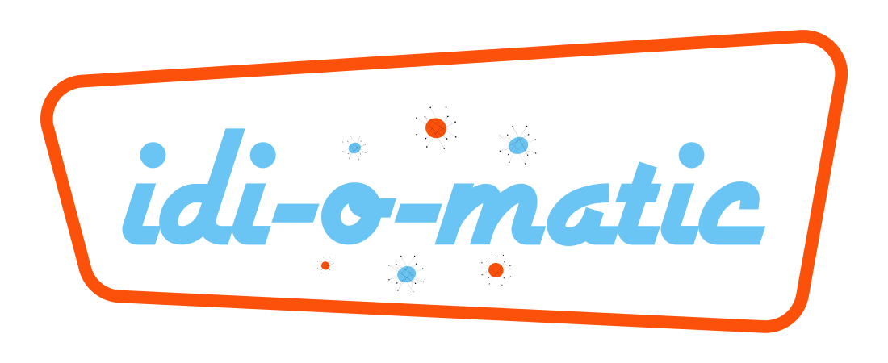
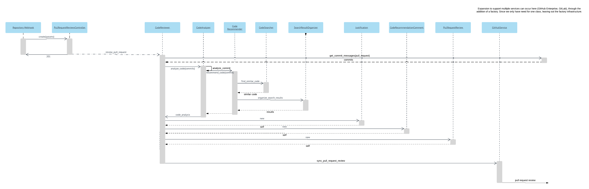
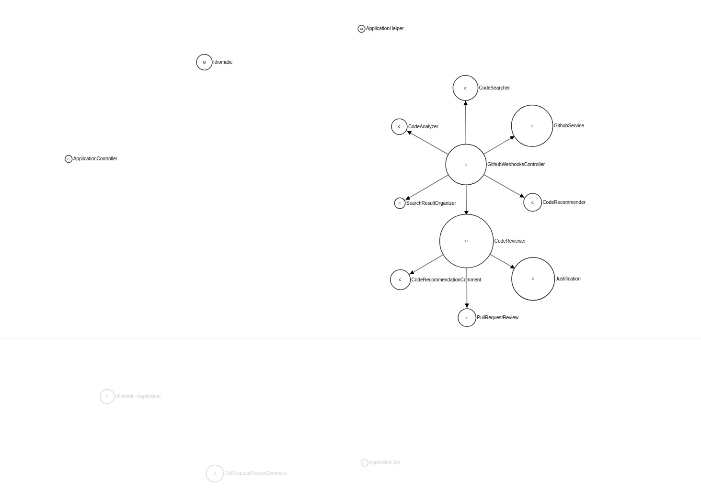

## idi-o-matic reviews your PR and provides examples of how popular repos did something similar.
[Example PR review](https://github.com/mkbehbehani/idi-o-matic-demo/pull/3):

## How it works
- When a PR is opened, idi-o-matic recieves a GitHub webhook payload and queries for the PR's commit messages.
- The commit messages are submitted to the very cool, experimental [GitHub Semantic Search](https://experiments.github.com/semantic-code-search)
- The experimental search results are filtered for match quality.
- idi-o-matic comments on the PR, suggesting relevant code along with the justification.

## Design
### GitHub-focused
- Extends the new, experimental [GitHub Semantic Search](https://experiments.github.com/semantic-code-search)
- Ruby-on-Rails based GitHub bot.
- Uses [Octokit](https://github.com/octokit/octokit.rb) for GitHub API interaction.
- Used the GitHub GraphQL API and starter app for initial research.

### Techniques
- Designed message behavior between classes using the sequence diagram design technique recommended in
[Practical Object-Oriented Design](https://www.poodr.com/) by [Sandi Metz](https://www.sandimetz.com/):

- Class dependency analysis. Good for now, but can be reduced further through factories once we add other search services:

### Technology
- Rails 5.2
- Fully automated CI/CD using Heroku

### Limitations
- The [GitHub Semantic Search](https://experiments.github.com/semantic-code-search) suggests python repos, so this app is limited to python suggestions as well at the moment.
